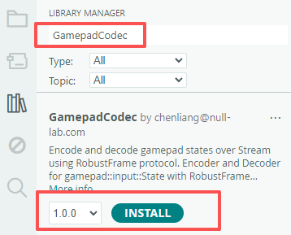
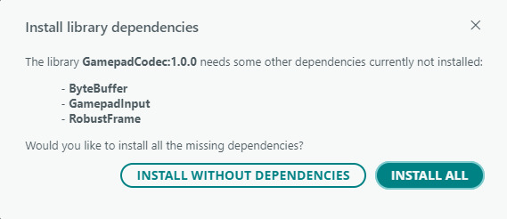

# GamepadCodec Arduino Library

[中文](README.zh-CN.md)

## Overview

**GamepadCodec** is a gamepad data encoding and decoding library based on the **Robust Frame** protocol, providing two core components: **Encoder** and **Decoder**. The **Encoder** is used to pack gamepad data into reliable frames; the **Decoder** is used to read frame data from a `Stream` byte stream and parse out the gamepad state.

> **💡 About `Stream`**: `Stream` is a base class in the Arduino core library for data stream communication. It defines the reading and parsing functionality in Arduino and provides a unified interface for all serial communications. Common classes like `HardwareSerial` and `SoftwareSerial` inherit from `Stream`, and `Serial` is a predefined instance of `HardwareSerial`. For more details on `Stream`, see the [Arduino Stream official documentation](https://docs.arduino.cc/language-reference/en/functions/communication/stream/).

### Use Background

When transmitting gamepad data over serial or Bluetooth, the receiving end needs to accurately identify the start and end of each frame, correctly handle special bytes that may appear in the data, and also be able to determine whether the received data is complete and correct. To meet these requirements, the **Robust Frame** protocol provides a complete solution: fixed frame headers and footers mark boundaries, escaping mechanisms prevent conflicts between data and frame identifiers, and CRC8 checksums ensure data integrity. This library further encapsulates the encoding and decoding logic for gamepad data. You simply need to set the gamepad state, and the library automatically handles framing and transmission; on the receiving end, the library automatically performs frame identification, validation, and decoding, then returns the parsed gamepad state to you.

### Robust Frame Protocol Documentation

For detailed information about the **Robust Frame** protocol (including frame structure, escaping mechanism, CRC8 checksum, and parser operation), please refer to the **[Robust Frame Protocol Documentation](<../../../robust_frame_arduino_lib/blob/main/README.md#robust-frame-arduino-lib>)**.

## Supported Platforms

This library is a pure software library and **does not depend on specific hardware platforms**. It can run on any platform that supports Arduino `Stream` objects.

## Features

- **Data Encode**: Pack gamepad state into reliable frames, supporting both `ByteBuffer` return and direct `Stream` writing.

- **Data Decode**: When reading data from `Stream`, the library automatically performs frame synchronization, escape restoration, and CRC validation, then returns the parsed gamepad state to you.

- **Button Event Detection**: Provides detection for three button events: **pressed**, **released**, and **holding**.

- **Joystick Axis Change Detection**: Configurable threshold to filter out minor joystick jitter, reporting only significant axis value changes.

## Installing the GamepadCodec Library

1. **Open the Arduino IDE Library Manager**

   - Menu: **Tools** → **Manage Libraries...**

   - Shortcut: `Ctrl+Shift+I` (Windows/Linux) or `Cmd+Shift+I` (Mac)

2. **Search and Install**

   - Enter `GamepadCodec` in the search box

   - Find the GamepadCodec library

   - **Make sure to select the latest version from the dropdown**

   - Click the **INSTALL** button

    

    > **📌 Note:** Screenshots are for reference only. Please always install the latest available version.

3. **Install Dependencies**

   - When the dependency installation dialog appears, select **INSTALL ALL**

    

> **⚠️ Important Version Notes**  
> Screenshots in this document may show older versions. **Always install the latest versions of the following libraries**:
>
> - `GamepadCodec` library
> - `ByteBuffer` dependency
> - `GamepadInput` dependency
> - `RobustFrame` dependency
>
> If you skipped dependency installation, manually install the latest versions of `ByteBuffer`, `GamepadInput`, and `RobustFrame`. For example, to install `ByteBuffer`:
>
> 1. Open the Library Manager again
> 2. Search for `ByteBuffer`
> 3. Select the **latest version** from the dropdown
> 4. Click Install

## Example Description

Examples are organized by **use case** in the `examples/` directory. Each example directory contains a complete Arduino program demonstrating a specific usage of the `GamepadCodec` library.

Currently, **Receiver Examples** are provided: demonstrating how to use the **Decoder** component to receive data from a `Stream` and parse out the gamepad state.

### Receiver Examples

Demonstrates how to receive data from a `Stream`, decode it using the `Decoder`, and detect button events and joystick changes via the `Tracker`.

Applicable for scenarios where a gamepad is used via a **BLE-to-serial module**, supporting two connection schemes:

- Board with integrated BLE-to-serial module

    Applicable for development boards with **on-board BLE-to-serial modules** (e.g., BLE-UNO). The MCU communicates with the Bluetooth chip via serial, working the same way as "development board + external BLE-to-serial module".

    | Compatible Boards |
    | :--- |
    | BLE-UNO |
    | BLE-NANO |

    > **📌 Note:** Currently, for CodexPad series gamepads (CodexPad-S10, CodexPad-C10), only the BLE-UNO board is supported. BLE-NANO is not supported at this time.

- Development board with external BLE-to-serial module

    Applicable for development boards **without on-board BLE-to-serial modules** (e.g., Arduino UNO, Nano), using an external BLE-to-serial module (e.g., NL-16) to connect the gamepad.

    **Supported External BLE-to-Serial Modules**

    | BLE-to-Serial Module |
    | :--- |
    | NL-16 (V1.2+) |

    **Supported Hardware Platforms**

    | Supported Hardware Platforms |
    | :--- |
    | Arduino UNO |
    | Arduino NANO |

#### BLE-UNO / BLE-NANO Board Examples

Both BLE-UNO and BLE-NANO boards have an integrated Bluetooth chip, **no external BLE-to-serial module is required**.

##### Available Examples

###### Basic Polling Example (`basic_polling`)

- **Description**: Connects to CodexPad via Bluetooth Device Address, periodically queries and prints all button states and joystick values.

- **Location**: In Arduino IDE, find this example via **File** → **Examples** → **GamepadCodec** → **decoder** → **ble_serial_module** → **basic_polling**.

###### Input State Detection Example (`inputs_detection`)

- **Description**: Connects to CodexPad via Bluetooth Device Address, prints button state and joystick value changes as they occur.

- **Location**: In Arduino IDE, find this example via **File** → **Examples** → **GamepadCodec** → **decoder** → **ble_serial_module** → **inputs_detection**.

##### How to View Debug Information

After running the example program, debug information (such as button events and joystick values) is output through the **debug serial port**. Since the default hardware serial port (D0/D1) is occupied by the Bluetooth module, you cannot view debug information through it. You need to use an additional debug serial port. Follow these steps:

1. Prepare an external serial tool, such as a **USB-to-TTL module**.

2. Connect the external serial tool to the corresponding debug serial pins according to the wiring instructions below (default pins are 5 and 6).

    **Using a USB-to-TTL module as an example**:

    | Board Pin | USB-to-TTL Module Pin |
    | :--- | :--- |
    | 5 | RXD |
    | 6 | TXD |
    | 3.3V | 3V3 |
    | GND | GND |

    > **📌 Note:** The pin numbers (5, 6) in the table above are the default configuration in the example code. If you change the debug serial pins in your code, use your actual configuration (`kDebugSerialRxPin` and `kDebugSerialTxPin`).

3. Upload the example program to the development board.

4. After uploading, power on the development board and run the program.

5. Plug the USB-to-TTL module into your computer's USB port. The system will recognize a new serial port (COM port).

6. Open any serial debug tool.

7. Select the serial port corresponding to the USB-to-TTL module, and set the baud rate to **115200**, data bits **8**, stop bits **1**, parity **None**.

8. Click "Open Serial Port" to view debug information in real time.

> **📌 Notes**:
>
> 1. The debug serial pin numbers (5/6) and baud rate (115200) shown above are the default values in the example code. If you modify them in your code, use your actual configuration.
> 2. After a successful connection, you will see a `Connected` message in the debug serial output. When you press buttons or move the joystick, the corresponding state changes will be printed immediately, e.g., `Button Triangle(Y): pressed`, `L(X:128, Y:0)`.

#### NL-16 BLE-to-Serial Module

The NL-16 BLE-to-serial module needs to be used with a development board.

> The NL-16 Bluetooth transparent module must use firmware version v1.2 or later to ensure compatibility with CodexPad gamepads.

##### Available Examples

###### Basic Polling Example (`basic_polling`)

- **Description**: Connects to CodexPad via Bluetooth Device Address, periodically queries and prints all button states and joystick values.

- **Location**: In Arduino IDE, find this example via **File** → **Examples** → **GamepadCodec** → **decoder** → **ble_serial_module** → **basic_polling**.

###### Input State Detection Example (`inputs_detection`)

- **Description**: Connects to CodexPad via Bluetooth Device Address, prints button state and joystick value changes as they occur.

- **Location**: In Arduino IDE, find this example via **File** → **Examples** → **GamepadCodec** → **decoder** → **ble_serial_module** → **inputs_detection**.

##### Wiring Instructions

Using Arduino UNO as an example:

**Arduino UNO to NL-16 Bluetooth Module Wiring**

| Arduino UNO Pin | NL‑16 Pin |
| :--- | :--- |
| 5V | +5V |
| GND | GND |
| RX0 | TXD |
| TX0 | RXD |
| RESET | STAT/D-RST |

> **📌 Note:** The pin numbers (5, 6) in the table above are the default configuration in the example code. If you change the debug serial pins in your code, use your actual configuration (`kDebugSerialRxPin` and `kDebugSerialTxPin`).

##### How to View Debug Information

After running the example program, debug information (such as button events and joystick values) is output through the **debug serial port**. Since the default hardware serial port (D0/D1) is occupied by the Bluetooth module, you cannot view debug information through it. You need to use an additional debug serial port. Follow these steps:

1. Prepare an external serial tool, such as a **USB-to-TTL module**.

2. Connect the external serial tool to the corresponding debug serial pins according to the wiring instructions below (default pins are 5 and 6).

    **Using a USB-to-TTL module as an example**:

    | Board Pin | USB-to-TTL Module Pin |
    | :--- | :--- |
    | 5 | RXD |
    | 6 | TXD |
    | 3.3V | 3V3 |
    | GND | GND |

    > **📌 Note:** The pin numbers (5, 6) in the table above are the default configuration in the example code. If you change the debug serial pins in your code, use your actual configuration (`kDebugSerialRxPin` and `kDebugSerialTxPin`).

3. Upload the example program to the development board.

4. After uploading, power on the development board and run the program.

5. Plug the USB-to-TTL module into your computer's USB port. The system will recognize a new serial port (COM port).

6. Open any serial debug tool.

7. Select the serial port corresponding to the USB-to-TTL module, and set the baud rate to **115200**, data bits **8**, stop bits **1**, parity **None**.

8. Click "Open Serial Port" to view debug information in real time.

> **📌 Notes**:
>
> 1. The debug serial pin numbers (5/6) and baud rate (115200) shown above are the default values in the example code. If you modify them in your code, use your actual configuration.
> 2. After a successful connection, you will see a `Connected` message in the debug serial output. When you press buttons or move the joystick, the corresponding state changes will be printed immediately, e.g., `Button Triangle(Y): pressed`, `L(X:128, Y:0)`.

## API Reference

Full API documentation: <https://codexpad.github.io/gamepad_codec_arduino_lib/html/en/index.html>

## License

This project is licensed under the MIT License - see the [LICENSE](LICENSE) file for details.
