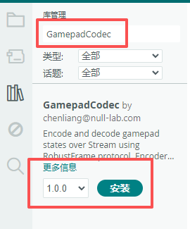
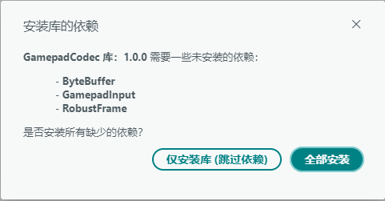
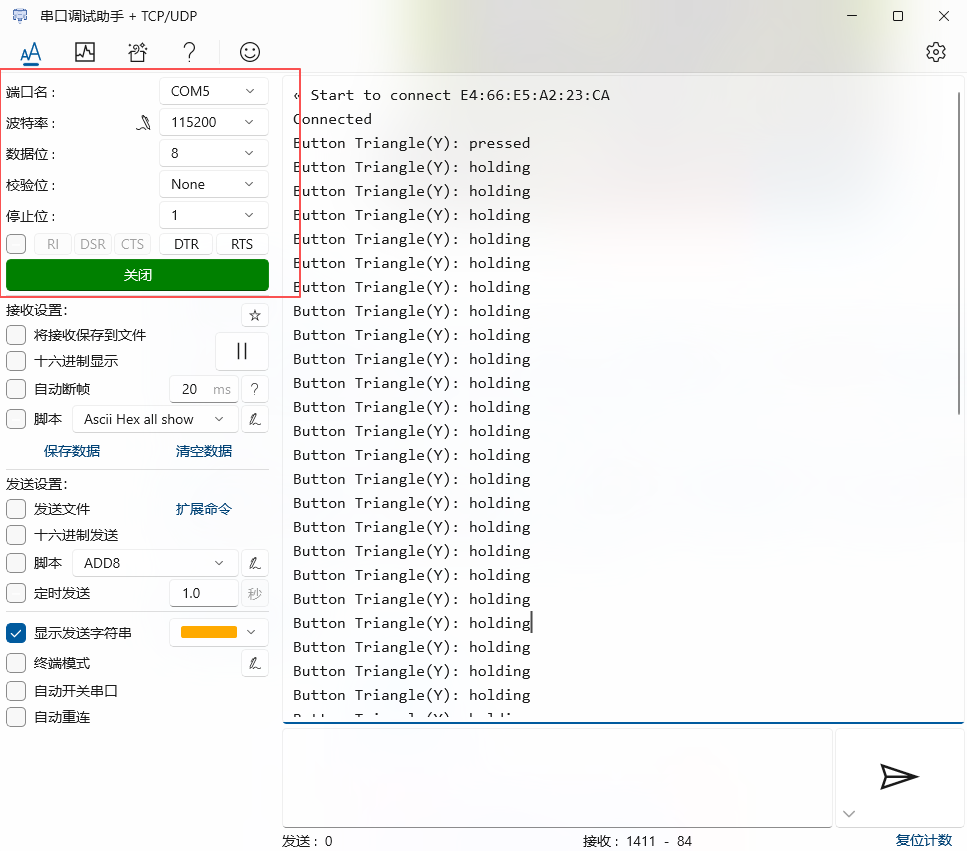
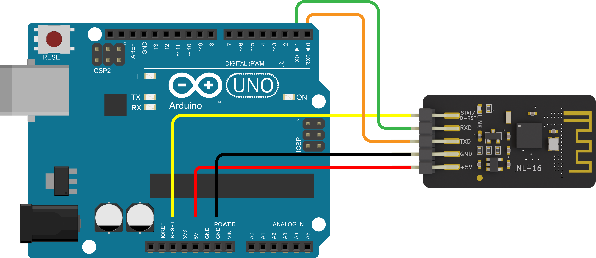

# GamepadCodec Arduino Library

[English](README.md)

## 概述

**GamepadCodec** 是一个基于 **Robust Frame** 协议的手柄数据编解码库，用于处理手柄数据，提供了 **Encoder** 和 **Decoder**两种核心组件：**Encoder**用于将手柄数据打包为可靠的帧数据；而**Decoder**则用于从`Stream`字节流中读取帧数据，并从中解析出手柄状态。

> **💡 关于 `Stream`**：`Stream` 是 Arduino 核心库中用于数据流通信的基类。它定义了 Arduino 中的读取和解析功能，为所有的串口通信提供了统一的接口。常见的 `HardwareSerial`（硬件串口类）和 `SoftwareSerial`（软件串口类）都继承自 `Stream`，其中 `Serial` 是 `HardwareSerial` 类的一个预定义实例。关于 `Stream` 的详细信息详见 [Arduino Stream 官方文档](https://docs.arduino.cc/language-reference/en/functions/communication/stream/)。

### 使用背景

在通过串口或蓝牙传输手柄数据时，接收端需要能够准确识别每一帧数据的起始与结束、正确处理数据中可能出现的特殊字节，同时还需要有能力判断收到的数据是否完整正确。为了满足这些需求，**Robust Frame** 协议提供了一套完整的解决方案：通过固定的帧头和帧尾标记边界，通过转义机制规避数据与帧标识的冲突，通过 CRC8 校验确保数据完整性。本库在此基础上进一步封装了手柄数据的编解码逻辑。您只需要设置好手柄状态，库会自动完成封帧和发送；接收端收到数据后，库会自动完成帧的识别、校验和解码，再将解析出的手柄状态反馈给你。

### Robust Frame 协议说明

关于 **Robust Frame** 协议的详细说明（包括帧结构、转义机制、CRC8 校验及解析器工作原理），请参阅 **[Robust Frame 协议文档](<../../../robust_frame_arduino_lib/blob/main/README.zh-CN.md#robust-frame-arduino-lib>)**。

## 支持的平台

本库是纯软件库，**不依赖特定硬件平台**，可运行于任何支持 Arduino `Stream` 对象的平台。

## 特性

- **数据编码**：将手柄状态打包为可靠的帧数据，支持返回 `ByteBuffer` 或直接写入 `Stream`。

- **数据解码**：从 `Stream` 读取数据时，库会自动完成帧同步、转义还原和 CRC 校验，再将解析出的手柄状态反馈给您。

- **按键事件检测**：提供按键的 **按下（pressed）**、**释放（released）**、**长按（holding）** 三种事件的检测能力。

- **摇杆轴变化检测**：可设置阈值过滤摇杆的微小抖动，仅在轴值发生显著变化时报告。

## 安装 GamepadCodec 库

1. **打开 Arduino IDE 库管理器**

   - 菜单栏：**工具** → **管理库...**

   - 快捷键：`Ctrl+Shift+I`（Windows/Linux）或 `Cmd+Shift+I`（Mac）

2. **搜索并安装**

   - 在搜索框中输入：`GamepadCodec`

   - 找到 GamepadCodec 库

   - **确保在下拉菜单中选择最新版本**

   - 点击 **安装** 按钮

    

    > **📌 注意：** 截图仅供参考。请务必安装最新可用版本。

3. **安装依赖库**

   - 当出现依赖库安装对话框时，选择 **全部安装**

    

> **⚠️ 重要版本说明**  
> 本文档中的截图可能显示较旧版本。**请始终安装以下库的最新版本**：
>
> - `GamepadCodec` 库
> - `ByteBuffer` 依赖库
> - `GamepadInput` 依赖库
> - `RobustFrame` 依赖库
>
> 如果您跳过了依赖库安装，请手动安装最新版 `ByteBuffer`、`GamepadInput` 和 `RobustFrame` 库，以安装 `ByteBuffer` 库为例：
>
> 1. 再次打开库管理器
> 2. 搜索 `ByteBuffer`
> 3. 在下拉菜单中**选择最新版本**
> 4. 点击安装

## 示例说明

示例按**使用场景**组织，位于 `examples/` 目录下。每个示例目录下包含一个完整的 Arduino 程序，展示 `GamepadCodec` 库的特定用法。

目前提供**接收端示例**：演示如何使用 **Decoder** 组件从 `Stream` 接收数据并解析出手柄状态。

### 接收端示例

演示如何从 `Stream` 接收数据，使用 `Decoder` 解码，并通过 `Tracker` 检测按键事件与摇杆变化。

适用于**通过 BLE 转串口模块来使用手柄**的场景，支持以下两种连接方案：

- 开发板板载集成BLE转串口模块

    适用于**板载了BLE转串口模块**的开发板（例如，BLE-UNO）。主控通过串口与蓝牙芯片进行通信，工作原理与 “开发板 + 外接BLE转串口模块” 相同。

    | 适用开发板 |
    | :--- |
    | BLE-UNO |
    | BLE-NANO |

    > **📌注意：**目前，对于CodexPad系列手柄（CodexPad-S10、CodexPad-C10）的连接使用，目前暂时只支持BLE-UNO开发板，对于BLE-NANO开发板则不支持。

- 开发板外接BLE转串口模块

    适用于**没有板载集成BLE转串口模块**的开发板（例如，Arduino UNO、Nano），通过外接BLE转串口模块（例如，NL-16）来使用手柄。

    **支持的外接BLE转串口模块**

    | BLE转串口模块 |
    | :--- |
    | NL-16 (V1.2+) |

    **支持的硬件平台**

    | 支持的硬件平台 |
    | :--- |
    | Arduino UNO |
    | Arduino NANO |

#### BLE-UNO / BLE-NANO 开发板示例

BLE-UNO 和 BLE-NANO 开发板均已板载集成蓝牙芯片，**无需外接 BLE 转串口模块**。

##### 可用示例

###### 基础轮询示例 (`basic_polling`)

- **示例说明**：通过Bluetooth Device Address与CodexPad蓝牙连接，实时查询、打印其所有按钮状态与摇杆数值。

- **示例位置**：在 Arduino IDE 中，通过 **文件** → **示例** → **GamepadCodec** → **decoder** → **ble_serial_module** → **basic_polling** 找到该示例。

###### 输入状态检测示例 (`inputs_detection`)

- **示例说明**：通过Bluetooth Device Address与CodexPad蓝牙连接，检测到按钮状态与摇杆数值变化后打印。

- **示例位置**：在 Arduino IDE 中，通过 **文件** → **示例** → **GamepadCodec** → **decoder** → **ble_serial_module** → **inputs_detection** 找到该示例。

##### 如何查看调试信息

示例程序运行后，调试信息（如按键事件、摇杆数值等）会通过**调试串口**输出。由于默认的硬件串口（D0/D1）已被蓝牙模块占用，无法通过此串口进行查看调试信息，所以需要通过调试串口查看输出。请按照以下步骤操作：

1. 准备一个外部串口工具，如**USB转TTL模块**。

2. 按照下方的接线说明，将外部串口工具连接到对应的调试串口引脚上（默认引脚号是 5, 6）。

    **外部串口工具以USB转TTL模块为例**：

    | 开发板引脚 | 外部串口工具引脚 |
    | :--- | :--- |
    | 5 | RXD |
    | 6 | TXD |
    | 3.3V | 3V3 |
    | GND | GND |

    > **📌 提示**：上表中的引脚号 (5, 6) 为示例代码中的默认配置。如果您在代码中修改了调试串口引脚，请以您代码中的实际配置为准（`kDebugSerialRxPin` 和 `kDebugSerialTxPin`）。

3. 将示例程序烧录到开发板中。

4. 烧录完成后，开发板上电运行程序。

5. 将外部串口工具插入电脑的 USB 口，此时系统会识别出一个新的串口（COM 口）。

6. 打开任意一款串口调试工具软件。

7. 选择外部串口工具对应的串口（COM 口），并设置波特率为 **115200**，数据位 **8**，停止位 **1**，校验位 **None**。

8. 点击“打开串口”，即可实时查看调试信息。

> **📌 提示**：
>
> 1. 以上调试串口的引脚号（5/6）和波特率（115200）为示例代码的默认值。如果您在代码中修改了调试串口的引脚或波特率中的值，请以您代码中的实际配置为准。
> 2. 连接成功后，在调试串口中，您会先看到 `Connected` 的提示。当您按下手柄按键或推动摇杆时，对应的状态变化会立即打印出来，例如 `Button Triangle(Y): pressed`、`L(X:128, Y:0)` 等

#### NL-16 BLE转串口模块

NL-16 BLE转串口模块需要配合开发板进行使用。

> NL-16 蓝牙透传模块请使用固件版本 v1.2 的，以确保与 CodexPad 手柄兼容。

##### 可用示例

###### 基础轮询示例 (`basic_polling`)

- **示例说明**：通过Bluetooth Device Address与CodexPad蓝牙连接，实时查询、打印其所有按钮状态与摇杆数值。

- **示例位置**：在 Arduino IDE 中，通过 **文件** → **示例** → **GamepadCodec** → **decoder** → **ble_serial_module** → **basic_polling** 找到该示例。

###### 输入状态检测示例 (`inputs_detection`)

- **示例说明**：通过Bluetooth Device Address与CodexPad蓝牙连接，检测到按钮状态与摇杆数值变化后打印。

- **示例位置**：在 Arduino IDE 中，通过 **文件** → **示例** → **GamepadCodec** → **decoder** → **ble_serial_module** → **inputs_detection** 找到该示例。

##### 接线说明

使用的开发板以 Arduino UNO 为例：

**Arduino UNO 与 NL-16 蓝牙透传模块接线**

| Arduino UNO 引脚 | NL‑16 引脚 |
| :--- | :--- |
| 5V | +5V |
| GND | GND |
| RX0 | TXD |
| TX0 | RXD |
| RESET | STAT/D-RST |

> **📌 提示**：上表中的引脚号 (5, 6) 为示例代码中的默认配置。如果您在代码中修改了调试串口引脚，请以您代码中的实际配置为准（`kDebugSerialRxPin` 和 `kDebugSerialTxPin`）。

##### 如何查看调试信息

示例程序运行后，调试信息（如按键事件、摇杆数值等）会通过**调试串口**输出。由于默认的硬件串口（D0/D1）已被蓝牙模块占用，无法通过此串口进行查看调试信息，所以需要通过调试串口查看输出。请按照以下步骤操作：

1. 准备一个外部串口工具，如**USB转TTL模块**。

2. 按照下方的接线说明，将外部串口工具连接到对应的调试串口引脚上（默认引脚号是 5, 6）。

    **外部串口工具以USB转TTL模块为例**：

    | BLE-UNO 引脚 | 外部串口工具引脚 |
    | :--- | :--- |
    | 5 | RXD |
    | 6 | TXD |
    | 3.3V | 3V3 |
    | GND | GND |

    > **📌 提示**：上表中的引脚号 (5, 6) 为示例代码中的默认配置。如果您在代码中修改了调试串口引脚，请以您代码中的实际配置为准（`kDebugSerialRxPin` 和 `kDebugSerialTxPin`）。

3. 将示例程序烧录到开发板中。

4. 烧录完成后,开发板上电运行程序。

5. 将外部串口工具插入电脑的 USB 口，此时系统会识别出一个新的串口（COM 口）。

6. 打开任意一款串口调试工具软件。

7. 选择外部串口工具对应的串口（COM 口），并设置波特率为 **115200**，数据位 **8**，停止位 **1**，校验位 **None**。

8. 点击“打开串口”，即可实时查看调试信息。

> **📌 提示**：
>
> 1. 以上调试串口的引脚号（5/6）和波特率（115200）为示例代码的默认值。如果您在代码中修改了调试串口的引脚或波特率中的值，请以您代码中的实际配置为准。
> 2. 连接成功后，在调试串口中，您会先看到 `Connected` 的提示。当您按下手柄按键或推动摇杆时，对应的状态变化会立即打印出来，例如 `Button Triangle(Y): pressed`、`L(X:128, Y:0)` 等

## API说明

详情链接：<https://codexpad.github.io/gamepad_codec_arduino_lib/html/zh-CN/annotated.html>

## 许可证

本项目采用 MIT 许可证 - 详见 [LICENSE](LICENSE) 文件。
